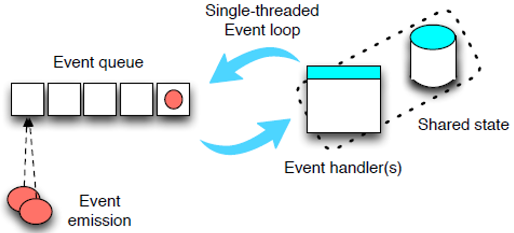

<input style="position: absolute; top: 20%;left: 10%;" type="button" onclick="location.href='https://rahgadda.github.io/Javascript/Advance/01-StrictMode.html';" value="Back" />
<input style="position: absolute; top: 20%;left: 45%;right: 50%;" type="button" onclick="location.href='https://rahgadda.github.io/Javascript';" value="Home" />
<input style="position: absolute; top: 20%;right: 10%;" type="button" onclick="location.href='https://rahgadda.github.io/Javascript/Basics/03-Objects.html';" value="Next" />
  

## Event Loop
- Primitive variables and Objects are allocated with memory in **Heap**. This is a large mostly unstructured region of memory.
- Incase of nested call's, Javascript stores the order of call's in the **Stack**. For example if function a() call's b() then stack a(),b(). Once b() returns then stack pops a() and then stack empties.
- JavaScript is fundamentally a **single threaded programming language**. It uses Event Loop programming model to achieve concurrency processing.
    - In an event based system, every concurrent interaction is modelled as an **event** triggered by an **event emitter**, which is processed by a single thread of execution, called the **event loop**.
    - The event loop has an associated **event queue**, which is used to schedule the execution of multiple pending events.
    - Every event has an associated **event handler function**. Every event handler can access and modify a global memory space, which is shared with other event handlers.
    - Every event handler comes along with an associated **safe shared state**, which can be shared between multiple handlers.
    - Events are added to the event queue with FIFO policy. This ensures that events produced with a given ordering are consumed (that is, executed) with the same ordering.
    

## Appendix
- [Event loop by Philip Roberts](https://www.youtube.com/watch?v=8aGhZQkoFbQ&t=1056s)