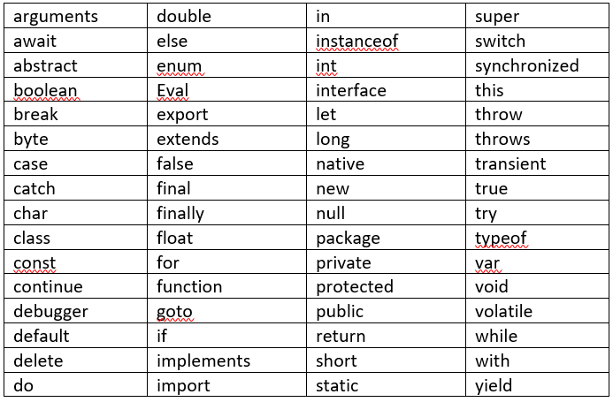

<input style="position: absolute; top: 20%;right: 10%;" type="button" onclick="location.href='https://rahgadda.github.io/Javascript/Keywords/02-Var.html';" value="Next" />
  

## Keywords

- Keywords are tokens that have special meaning in JavaScript. These are reserved words by programing languages for a specific need.
- Keywords cannot be used as variables, labels, or function names.
- Javascript also provides non-reserved words **NaN**,**Infinity** and **undefined** that act like reserved words.  
  `var NaN = 42; \\ will not throw any error`
- Below are the list of Javascript keywords.
  
